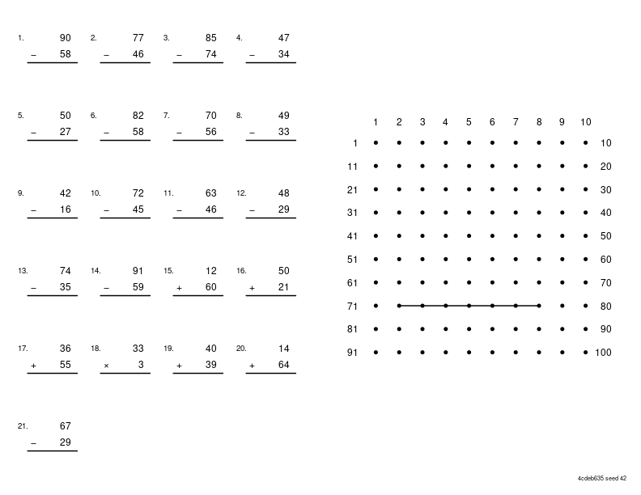
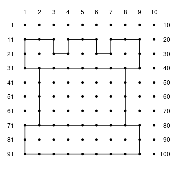
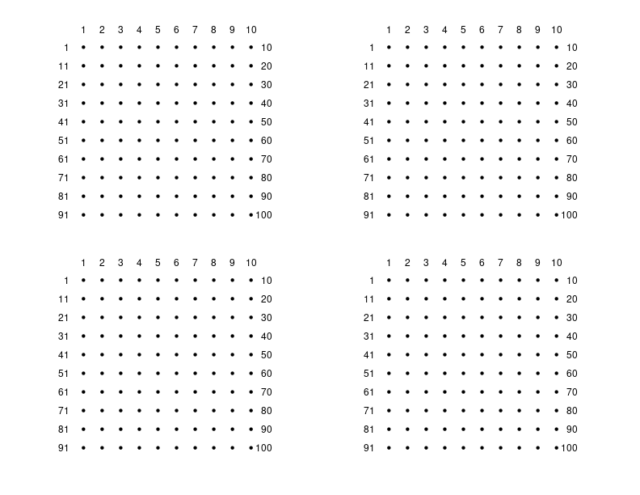

# figurenumbers

[](https://cran.r-project.org/package=figurenumbers)
[](https://github.com/trevorld/figurenumbers/actions)
[](https://app.codecov.io/gh/trevorld/figurenumbers)

### Table of Contents

* [Overview](#overview)
* [Installation](#installation)
* [Examples](#examples)

## <a name="overview">Overview</a>

`{figurenumbers}` helps create print-and-play "connect-the-dots" puzzles where first you need to solve math problems to calculate the figure numbers and then use those numbers to draw a figure by connecting the dots in sequence with line segments in a 10x10 grid of numbers from 1 to 100.  It is inspired by the out-of-print *Calc-U-Draw* by Buki Ltd (1990) which my son liked and wanted more puzzles for but `{figurenumbers}` features new figures, randomly generated math problems, and a layout that can be used for printing out as standalone worksheets or as part of a saddle-stitched half-letter (or A5) booklet.


## <a name="installation">Installation</a>


``` r
remotes::install_github("trevorld/figurenumbers")
```

## <a name="examples">Examples</a>


Here we create a printable PDF of the bundled "rook" puzzle.


``` r
library("figurenumbers")
library("grid")
puzzle <- read_puzzles()$rook
cairo_pdf("rook_puzzle.pdf", width = 11, height = 8.5) # landscape letter
grid.draw(puzzleGrob(puzzle$segments, seed = 42, hash = puzzle$hash))
invisible(dev.off())
```


Here is what the "rook" figure should look like after all the math problems have been solved correctly and the corresponding line segments have been drawn in order.


``` r
library("figurenumbers")
library("grid")
puzzle <- read_puzzles()$rook
grid.draw(numberGridGrob(puzzle$segments))
```



Here we create a two-sided printable PDF of blank number grids to hand-sketch candidate puzzle pictures on before encoding the best ones as `segments` in `inst/puzzles.yaml`.


``` r
library("figurenumbers")
library("grid")
cairo_pdf("blank_grids.pdf", width = 11, height = 8.5) # landscape letter
grid.draw(gridsGrob())
grid.newpage()
grid.draw(gridsGrob())
invisible(dev.off())
```

